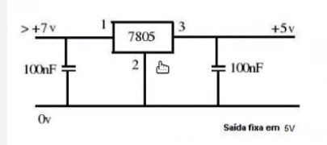

# Apresentação do dia 18/10/23

# A OBSAT foi remarcada

- Onde estamos:

    Trocado o sistema embarcado "ESP32 --> Raspberry Nano"
    Troca de MPU, pelos sensores da AdaFruit BNO055 q
    Transcrição para Python, dos códigos em em C++ --> Ribamar já começou

- Tarefas Principais:

    Ler no Notion as tasks
    Fazer um regulador para transformar 8v em 5v
    Se usar a célula de lítio, não haverá problemas

- Tarefa de Julius:

    Regulador de tensão LM7805  --> Limitação de corrente... Esquenta, mas passa correntes altas, Problema se tivesse que dar um buster

    Buscar circuitos alternativos para a redução de 8v para 5v.
    
    Bateria: ncr18650b-2

- Estudar Sobre:

    Sensor de corrente e seus tipos

- Prazo 18/11